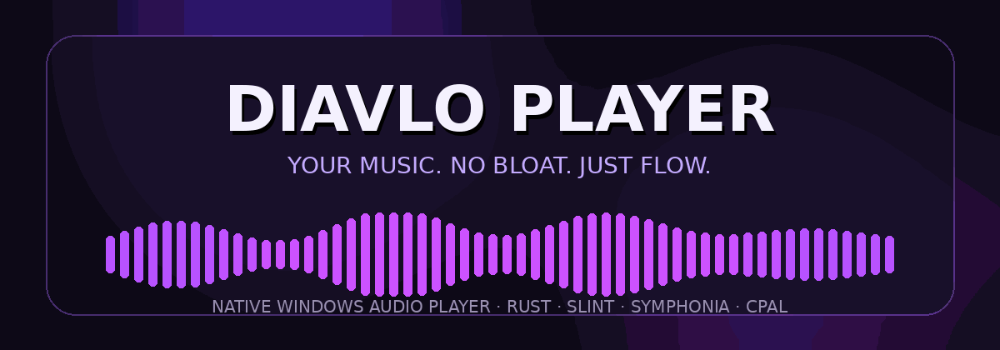

<div align="center">



<br>


<br>

[](https://github.com/Nikolai-coder/diavlo-player/releases/latest)
[](#-requisitos)
[](#-tecnología)
[](#-licencia)

<br>

[**Descargar**](https://github.com/Nikolai-coder/diavlo-player/releases/latest) ·
[**Download**](https://github.com/Nikolai-coder/diavlo-player/releases/latest) ·
[**Reportar un problema**](https://github.com/Nikolai-coder/diavlo-player/issues)

<br>

[🇪🇸 Español](#-español) · [🇬🇧 English](#-english)

</div>

---

# 🇪🇸 Español

## La música primero

**DIAVLO PLAYER** es un reproductor de audio moderno para Windows con una interfaz oscura de cristal, una arquitectura nativa y una filosofía sencilla:

> **Abrir. Soltar. Escuchar.**

Sin una interfaz inflada. Sin capas innecesarias. Sin romper el ritmo.

<div align="center">


</div>

## ✦ Características

| | Función | Descripción |
|---|---|---|
| 🪟 | **Diseño glass nativo** | Ventana sin bordes con desenfoque DWM, estética oscura y acabado moderno. |
| 🎧 | **Formatos amplios** | Reproduce WAV, FLAC, MP3, AAC, OGG, Opus, AIFF y M4A. |
| 🖱️ | **Arrastrar y soltar** | Suelta un archivo de audio directamente sobre la ventana y empieza a escuchar. |
| ⌨️ | **Uso desde terminal** | Abre y reproduce canciones pasando la ruta del archivo desde la línea de comandos. |
| 🔗 | **Asociaciones de archivos** | Puede registrarse en Windows como reproductor para formatos de audio compatibles. |
| 🪶 | **Ligero por diseño** | Binario compacto y consumo contenido. Escuchar música no debería arrancar un reactor nuclear. |
| 🦀 | **Nativo y rápido** | Construido con Rust y tecnologías enfocadas en rendimiento y seguridad. |

---

## 🎵 Formatos compatibles

<div align="center">


</div>

---

## ⬇️ Descargar

La versión más reciente está disponible en **GitHub Releases**:

<div align="center">

### [⚡ Descargar DIAVLO PLAYER](https://github.com/Nikolai-coder/diavlo-player/releases/latest)

</div>

Para la versión portable:

1. Descarga `diavlo-player.exe`.
2. Ejecuta el archivo.
3. Arrastra una canción sobre la ventana o ábrela desde Windows.

No necesita instalación para usar la versión portable.

---

## ⚡ Uso

### Abrir el reproductor

```powershell
.\diavlo-player.exe
```

### Abrir una canción directamente

```powershell
.\diavlo-player.exe "C:\Music\mi-cancion.mp3"
```

### Ruta con espacios

```powershell
.\diavlo-player.exe "D:\Mi Música\album\track 01.flac"
```

---

## 🖥️ Requisitos

- Windows 10 o posterior.
- Sistema de 64 bits.
- DWM habilitado para mostrar correctamente el efecto de cristal.

---

## 🧱 Tecnología

DIAVLO PLAYER está construido sobre un stack nativo y compacto:

| Tecnología | Función |
|---|---|
| **Rust** | Núcleo de la aplicación, rendimiento y seguridad de memoria. |
| **Slint** | Interfaz gráfica nativa. |
| **Symphonia** | Decodificación de audio. |
| **CPAL** | Salida de audio multiplataforma con integración nativa. |
| **Windows DWM** | Efectos visuales de desenfoque y cristal. |

---

## 🗺️ Visión

DIAVLO PLAYER nace con una idea clara: convertirse en un reproductor de escritorio elegante, directo y extremadamente cómodo para escuchar audio local.

Las futuras mejoras se publicarán en la sección de [Releases](https://github.com/Nikolai-coder/diavlo-player/releases).

---

## 🐞 Problemas y sugerencias

¿Encontraste un fallo o tienes una idea que encaja con el proyecto?

[Abre una issue](https://github.com/Nikolai-coder/diavlo-player/issues) incluyendo:

- Versión de Windows.
- Versión de DIAVLO PLAYER.
- Formato del archivo afectado.
- Pasos para reproducir el problema.
- Captura o registro del error, cuando sea posible.

---

## 🔒 Licencia

DIAVLO PLAYER es software propietario.

**Todos los derechos reservados.** No se permite copiar, redistribuir, modificar, sublicenciar ni comercializar el software o su código sin autorización expresa de sus propietarios.

---

# 🇬🇧 English

## Music comes first

**DIAVLO PLAYER** is a modern audio player for Windows with a dark glass interface, a native architecture and one simple philosophy:

> **Open. Drop. Listen.**

No bloated interface. No unnecessary layers. No broken flow.

<div align="center">


</div>

## ✦ Features

| | Feature | Description |
|---|---|---|
| 🪟 | **Native glass design** | Frameless window with DWM blur, a dark aesthetic and a modern finish. |
| 🎧 | **Wide format support** | Plays WAV, FLAC, MP3, AAC, OGG, Opus, AIFF and M4A. |
| 🖱️ | **Drag and drop** | Drop an audio file directly onto the window and start listening. |
| ⌨️ | **Command-line support** | Open and play tracks by passing a file path from the terminal. |
| 🔗 | **File associations** | Can register with Windows as a player for supported audio formats. |
| 🪶 | **Lightweight by design** | Compact and restrained. Playing music should not launch a nuclear reactor. |
| 🦀 | **Native and fast** | Built with Rust and technologies focused on performance and safety. |

---

## 🎵 Supported formats

<div align="center">


</div>

---

## ⬇️ Download

The latest version is available from **GitHub Releases**:

<div align="center">

### [⚡ Download DIAVLO PLAYER](https://github.com/Nikolai-coder/diavlo-player/releases/latest)

</div>

For the portable version:

1. Download `diavlo-player.exe`.
2. Run the file.
3. Drop a song onto the window or open it from Windows.

The portable version does not require installation.

---

## ⚡ Usage

### Open the player

```powershell
.\diavlo-player.exe
```

### Open a track directly

```powershell
.\diavlo-player.exe "C:\Music\my-song.mp3"
```

### Paths containing spaces

```powershell
.\diavlo-player.exe "D:\My Music\album\track 01.flac"
```

---

## 🖥️ Requirements

- Windows 10 or later.
- 64-bit system.
- DWM enabled to display the glass effect correctly.

---

## 🧱 Technology

DIAVLO PLAYER is powered by a compact native stack:

| Technology | Purpose |
|---|---|
| **Rust** | Application core, performance and memory safety. |
| **Slint** | Native graphical interface. |
| **Symphonia** | Audio decoding. |
| **CPAL** | Cross-platform audio output with native integration. |
| **Windows DWM** | Blur and glass visual effects. |

---

## 🗺️ Vision

DIAVLO PLAYER was created with a clear goal: to become an elegant, direct and extremely comfortable desktop player for local audio.

Future improvements will be published in [Releases](https://github.com/Nikolai-coder/diavlo-player/releases).

---

## 🐞 Issues and feedback

Found a bug or have an idea that fits the project?

[Open an issue](https://github.com/Nikolai-coder/diavlo-player/issues) and include:

- Windows version.
- DIAVLO PLAYER version.
- Affected audio format.
- Steps to reproduce the problem.
- A screenshot or error log, when available.

---

## 🔒 License

DIAVLO PLAYER is proprietary software.

**All rights reserved.** Copying, redistributing, modifying, sublicensing or commercializing the software or its source code is not permitted without express authorization from Diavlo.

<br>

<div align="center">


</div>
